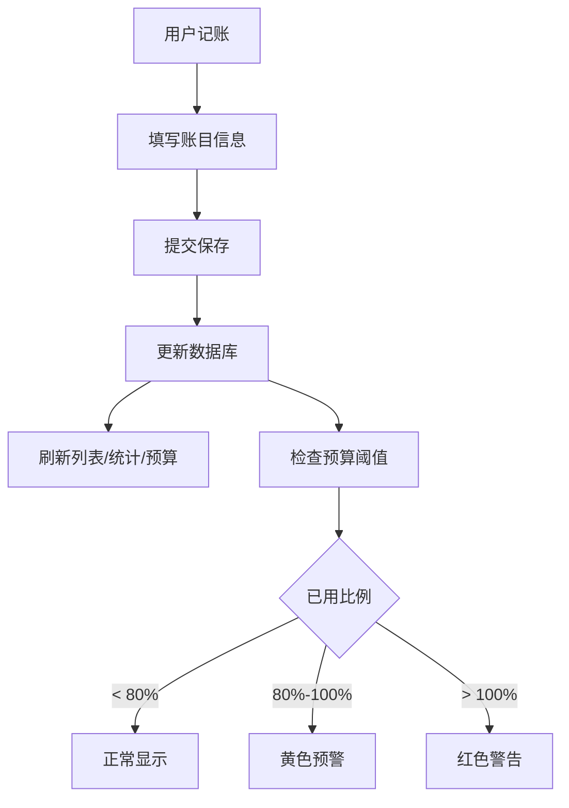

## 1. 产品概述

家庭多人记账Web应用——帮助家庭成员协同记录收支、管理预算、追踪AA分账的一站式家庭财务管理工具。
- 解决家庭多人记账混乱、分账不清、预算超支无预警等痛点
- 面向家庭用户，支持多成员协作记账与财务透明

## 2. 核心功能

### 2.1 用户角色

| 角色 | 注册方式 | 核心权限 |
|------|----------|----------|
| 家庭成员 | 由已有成员添加 | 记账、查看统计、管理预算、导入导出数据 |

### 2.2 功能模块

1. **记账页面**: 收支记录的增删改查，含金额/类别/备注/日期/记账人/标签
2. **成员管理页面**: 家庭成员的添加/删除，头像emoji和名称管理，AA分账记录
3. **预算管理页面**: 按月设置总预算和分类预算，实时进度和预警
4. **统计分析页面**: 月度趋势图、分类饼图、日均消费、同比变化、TOP5、标签汇总
5. **数据导入导出页面**: CSV/JSON导入导出，支付宝/微信账单自动识别
6. **定期账目页面**: 周期性账目设置，自动生成，暂停/恢复/删除

### 2.3 页面详情

| 页面名称 | 模块名称 | 功能描述 |
|----------|----------|----------|
| 记账页面 | 记账表单 | 金额输入、类别选择(餐饮/交通/购物/医疗/教育/娱乐/居住/其他)、收支切换、备注、日期选择、记账人选择、标签多选 |
| 记账页面 | 账目列表 | 按日期倒序展示所有账目，支持按成员/类别/日期筛选，编辑和删除需确认弹窗 |
| 成员管理页面 | 成员列表 | 展示所有家庭成员(头像emoji+名称)，添加/删除成员 |
| 成员管理页面 | AA分账 | 选择垫付人和受益人，输入金额，生成应收应付记录，展示成员间结算关系 |
| 预算管理页面 | 预算设置 | 按月设置总预算和各分类预算金额 |
| 预算管理页面 | 预算进度 | 实时显示各类别已用/剩余，超80%黄色预警，超100%红色警告，预算完成度环形图 |
| 统计分析页面 | 趋势图 | 近6个月收支趋势折线图 |
| 统计分析页面 | 分类占比 | 支出分类占比饼图 |
| 统计分析页面 | 数据指标 | 日均消费、同比上月变化率、最大单笔支出TOP5、按标签汇总 |
| 数据导入导出页面 | CSV导入 | 上传CSV文件，映射列名，支持支付宝/微信账单CSV格式自动识别 |
| 数据导入导出页面 | 导出 | 导出为CSV或JSON格式 |
| 定期账目页面 | 定期任务列表 | 展示所有周期性账目，暂停/恢复/删除操作 |
| 定期账目页面 | 新增定期任务 | 设置周期(月/周/年)、金额、类别、记账人等信息 |

## 3. 核心流程

### 3.1 记账流程
用户进入记账页面 → 填写金额/选择类别/选择收支类型/选记账人/选标签 → 提交 → 账目写入数据库 → 列表实时更新

### 3.2 AA分账流程
用户选择"垫付" → 选垫付人和受益人 → 输入金额 → 系统生成应收应付记录 → 在成员管理中可查看结算关系

### 3.3 预算预警流程
用户设置月度预算 → 每次记账后系统计算已用比例 → 超80%显示黄色预警 → 超100%显示红色警告

### 3.4 定期账目流程
用户创建定期任务 → 系统存储任务配置 → 后端启动时/定时检查到期任务 → 自动生成对应账目记录

## 4. 用户界面设计

### 4.1 设计风格
- 主色调: 深墨绿(#1B4332)搭配暖金(#D4A574)点缀，传达稳重与温馨的家庭财务感
- 辅助色: 浅灰背景(#F8F9FA)、白色卡片、红色支出(#E63946)、绿色收入(#2D6A4F)
- 按钮风格: 圆角按钮(8px)，主操作用实色填充，次操作用描边
- 字体: 标题使用 Noto Serif SC(衬线)，正文使用 Noto Sans SC(无衬线)
- 布局: 左侧导航栏 + 右侧内容区，卡片式布局
- 图标风格: Lucide线性图标 + Emoji头像

### 4.2 页面设计概览

| 页面名称 | 模块名称 | UI元素 |
|----------|----------|--------|
| 记账页面 | 记账表单 | 顶部卡片表单，收入/支出切换标签，金额大号输入，类别网格选择，标签多选胶囊，日期/记账人下拉 |
| 记账页面 | 账目列表 | 时间线式列表，每条左滑操作，筛选栏置顶，编辑弹窗确认 |
| 成员管理页面 | 成员列表 | 横排头像卡片，emoji大号显示，名称下方，添加按钮末尾 |
| 成员管理页面 | AA分账 | 分账表单+结算关系矩阵，箭头连接垫付人和受益人 |
| 预算管理页面 | 预算设置 | 月度选择器，总预算+分类预算编辑卡片 |
| 预算管理页面 | 预算进度 | 环形进度图，分类进度条，预警状态颜色变化 |
| 统计分析页面 | 趋势图 | ECharts折线图，双线(收入/支出)，月份X轴 |
| 统计分析页面 | 分类占比 | ECharts饼图，hover显示金额和比例 |
| 统计分析页面 | 数据指标 | 指标卡片网格，数字大号+标签小号 |
| 数据导入导出页面 | 导入区 | 拖拽上传区域，列名映射表格，格式自动识别提示 |
| 数据导入导出页面 | 导出区 | 格式选择按钮(CSV/JSON)，导出按钮 |
| 定期账目页面 | 任务列表 | 卡片式列表，周期标签，状态指示灯，操作按钮组 |

### 4.3 响应式设计
- 桌面优先设计，最小宽度1200px完整体验
- 平板适配: 导航栏折叠为底部标签栏
- 手机适配: 单列布局，表单全宽，图表缩放

### 4.4 导航结构
- 左侧固定导航栏: 记账、成员、预算、统计、导入导出、定期账目
- 顶部: 当前月份选择器 + 家庭名称
- 移动端: 底部Tab导航
