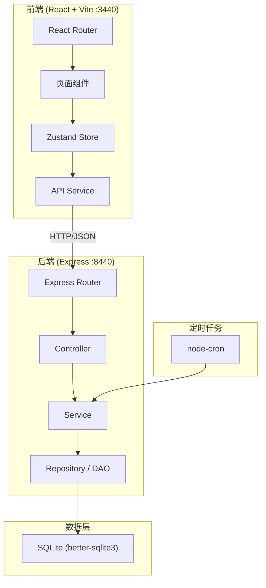
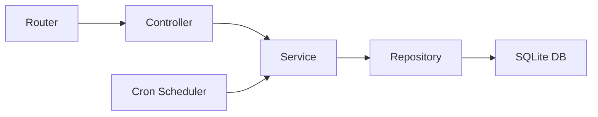
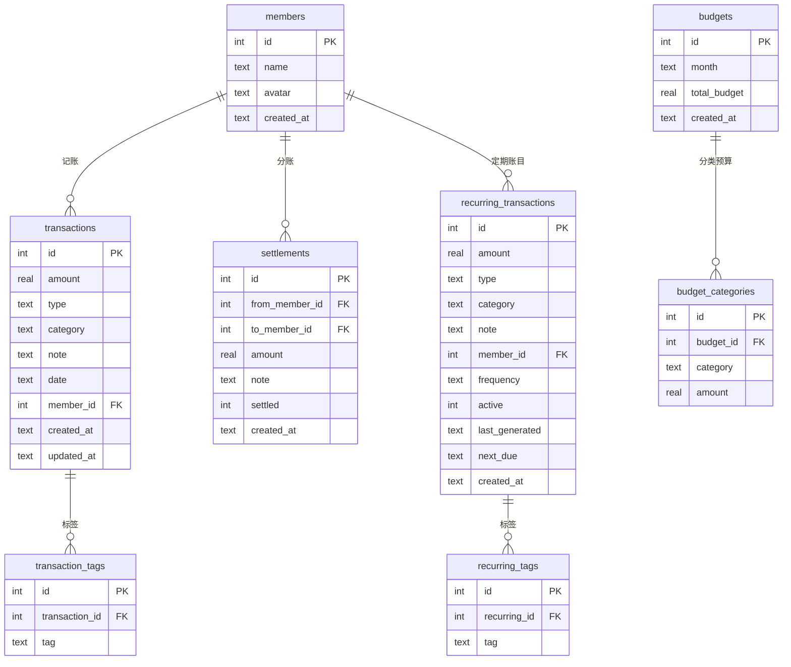

## 1. 架构设计



## 2. 技术说明

- 前端: React@18 + TypeScript + Tailwind CSS@3 + Vite + Zustand + ECharts
- 初始化工具: vite-init (react-express-ts 模板)
- 后端: Express@4 + TypeScript + better-sqlite3 + node-cron
- 数据库: SQLite (better-sqlite3，文件存储 `data/accounting.db`)
- 图表: ECharts (通过 echarts-for-react)
- 前端端口: 3440, 后端端口: 8440

## 3. 路由定义

| 路由 | 用途 |
|------|------|
| `/` | 记账页面 - 收支记录增删改查 |
| `/members` | 成员管理 - 家庭成员与AA分账 |
| `/budget` | 预算管理 - 月度预算设置与进度 |
| `/stats` | 统计分析 - 趋势图/饼图/指标 |
| `/import-export` | 数据导入导出 |
| `/recurring` | 定期账目管理 |

## 4. API 定义

### 4.1 账目相关

```typescript
// GET /api/transactions?month=2026-06&memberId=1&category=餐饮
interface TransactionQuery {
  month?: string;
  memberId?: number;
  category?: string;
  type?: 'income' | 'expense';
}
interface Transaction {
  id: number;
  amount: number;
  type: 'income' | 'expense';
  category: string;
  note: string;
  date: string;
  memberId: number;
  tags: string[];
  createdAt: string;
  updatedAt: string;
}
// POST /api/transactions
// PUT /api/transactions/:id
// DELETE /api/transactions/:id
```

### 4.2 成员相关

```typescript
// GET /api/members
interface Member {
  id: number;
  name: string;
  avatar: string;
  createdAt: string;
}
// POST /api/members
// DELETE /api/members/:id
```

### 4.3 AA分账相关

```typescript
// GET /api/settlements
interface Settlement {
  id: number;
  fromMemberId: number;
  toMemberId: number;
  amount: number;
  note: string;
  settled: boolean;
  createdAt: string;
}
// POST /api/settlements
// PUT /api/settlements/:id/settle
```

### 4.4 预算相关

```typescript
// GET /api/budgets?month=2026-06
interface Budget {
  id: number;
  month: string;
  totalBudget: number;
  categoryBudgets: Record<string, number>;
}
// POST /api/budgets
// PUT /api/budgets/:id
// GET /api/budgets/progress?month=2026-06
interface BudgetProgress {
  total: { budget: number; spent: number; remaining: number; percentage: number };
  categories: Record<string, { budget: number; spent: number; remaining: number; percentage: number }>;
}
```

### 4.5 统计相关

```typescript
// GET /api/stats/trend?months=6
interface TrendData {
  months: string[];
  income: number[];
  expense: number[];
}
// GET /api/stats/category-pie?month=2026-06
interface CategoryPie {
  category: string;
  amount: number;
  percentage: number;
}[]
// GET /api/stats/summary?month=2026-06
interface StatsSummary {
  dailyAverage: number;
  monthOverMonthChange: number;
  topExpenses: Transaction[];
  tagSummary: Record<string, number>;
}
```

### 4.6 导入导出相关

```typescript
// POST /api/import/csv
interface ImportResult {
  success: number;
  failed: number;
  errors: string[];
}
// GET /api/export/csv?month=2026-06
// GET /api/export/json?month=2026-06
```

### 4.7 定期账目相关

```typescript
// GET /api/recurring
interface RecurringTransaction {
  id: number;
  amount: number;
  type: 'income' | 'expense';
  category: string;
  note: string;
  memberId: number;
  tags: string[];
  frequency: 'daily' | 'weekly' | 'monthly' | 'yearly';
  active: boolean;
  lastGenerated: string | null;
  nextDue: string;
  createdAt: string;
}
// POST /api/recurring
// PUT /api/recurring/:id/toggle
// DELETE /api/recurring/:id
```

## 5. 服务端架构图



## 6. 数据模型

### 6.1 数据模型定义



### 6.2 数据定义语言

```sql
CREATE TABLE IF NOT EXISTS members (
  id INTEGER PRIMARY KEY AUTOINCREMENT,
  name TEXT NOT NULL,
  avatar TEXT NOT NULL DEFAULT '👤',
  created_at TEXT NOT NULL DEFAULT (datetime('now'))
);

CREATE TABLE IF NOT EXISTS transactions (
  id INTEGER PRIMARY KEY AUTOINCREMENT,
  amount REAL NOT NULL,
  type TEXT NOT NULL CHECK(type IN ('income', 'expense')),
  category TEXT NOT NULL,
  note TEXT DEFAULT '',
  date TEXT NOT NULL,
  member_id INTEGER NOT NULL,
  created_at TEXT NOT NULL DEFAULT (datetime('now')),
  updated_at TEXT NOT NULL DEFAULT (datetime('now')),
  FOREIGN KEY (member_id) REFERENCES members(id) ON DELETE CASCADE
);

CREATE TABLE IF NOT EXISTS transaction_tags (
  id INTEGER PRIMARY KEY AUTOINCREMENT,
  transaction_id INTEGER NOT NULL,
  tag TEXT NOT NULL,
  FOREIGN KEY (transaction_id) REFERENCES transactions(id) ON DELETE CASCADE
);

CREATE TABLE IF NOT EXISTS settlements (
  id INTEGER PRIMARY KEY AUTOINCREMENT,
  from_member_id INTEGER NOT NULL,
  to_member_id INTEGER NOT NULL,
  amount REAL NOT NULL,
  note TEXT DEFAULT '',
  settled INTEGER NOT NULL DEFAULT 0,
  created_at TEXT NOT NULL DEFAULT (datetime('now')),
  FOREIGN KEY (from_member_id) REFERENCES members(id) ON DELETE CASCADE,
  FOREIGN KEY (to_member_id) REFERENCES members(id) ON DELETE CASCADE
);

CREATE TABLE IF NOT EXISTS budgets (
  id INTEGER PRIMARY KEY AUTOINCREMENT,
  month TEXT NOT NULL UNIQUE,
  total_budget REAL NOT NULL DEFAULT 0,
  created_at TEXT NOT NULL DEFAULT (datetime('now'))
);

CREATE TABLE IF NOT EXISTS budget_categories (
  id INTEGER PRIMARY KEY AUTOINCREMENT,
  budget_id INTEGER NOT NULL,
  category TEXT NOT NULL,
  amount REAL NOT NULL DEFAULT 0,
  FOREIGN KEY (budget_id) REFERENCES budgets(id) ON DELETE CASCADE
);

CREATE TABLE IF NOT EXISTS recurring_transactions (
  id INTEGER PRIMARY KEY AUTOINCREMENT,
  amount REAL NOT NULL,
  type TEXT NOT NULL CHECK(type IN ('income', 'expense')),
  category TEXT NOT NULL,
  note TEXT DEFAULT '',
  member_id INTEGER NOT NULL,
  frequency TEXT NOT NULL CHECK(frequency IN ('daily', 'weekly', 'monthly', 'yearly')),
  active INTEGER NOT NULL DEFAULT 1,
  last_generated TEXT,
  next_due TEXT NOT NULL,
  created_at TEXT NOT NULL DEFAULT (datetime('now')),
  FOREIGN KEY (member_id) REFERENCES members(id) ON DELETE CASCADE
);

CREATE TABLE IF NOT EXISTS recurring_tags (
  id INTEGER PRIMARY KEY AUTOINCREMENT,
  recurring_id INTEGER NOT NULL,
  tag TEXT NOT NULL,
  FOREIGN KEY (recurring_id) REFERENCES recurring_transactions(id) ON DELETE CASCADE
);

CREATE INDEX IF NOT EXISTS idx_transactions_date ON transactions(date);
CREATE INDEX IF NOT EXISTS idx_transactions_member ON transactions(member_id);
CREATE INDEX IF NOT EXISTS idx_transactions_category ON transactions(category);
CREATE INDEX IF NOT EXISTS idx_transaction_tags_transaction ON transaction_tags(transaction_id);
CREATE INDEX IF NOT EXISTS idx_settlements_from ON settlements(from_member_id);
CREATE INDEX IF NOT EXISTS idx_settlements_to ON settlements(to_member_id);
CREATE INDEX IF NOT EXISTS idx_budget_categories_budget ON budget_categories(budget_id);
CREATE INDEX IF NOT EXISTS idx_recurring_active ON recurring_transactions(active);
```
